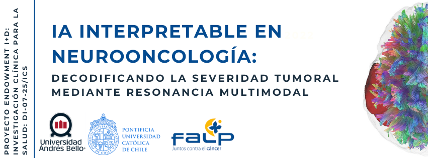

# Workshop: IA Interpretable en Neurooncología: Decodificando la severidad tumoral mediante resonancia multimodal

Este repositorio contiene los materiales para el laboratorio virtual sobre neurooncología de precisión. El workshop integra cuatro fases críticas del análisis de imágenes médicas:
1. **Fundamentos del Espacio K y Formación de Imágenes:** Exploración interactiva del dominio de la frecuencia en resonancia magnética (RM). Se analiza cómo se codifica la información espacial y cómo el filtrado de bajas y altas frecuencias impacta en el contraste y la resolución de la imagen diagnóstica.
1. **Física de Resonancia:** Generación de mapas paramétricos ($T1$ y $T2$) a partir de datos crudos.
2. **Microestructura Tisular:** Procesamiento de Tensores de Difusión (DTI) para evaluar la integridad de la sustancia blanca.
3. **IA Interpretable:** Decodificación de la severidad tumoral mediante radiómica multimodal y Machine Learning.



## Respaldo Científico

Este laboratorio virtual implementa los findazgos descritos en el estudio:

> **"Beyond Binary Classification: A Pilot Study of Imaging-Derived Glioma Severity Modeling Using T1-Weighted and Diffusion MRI Radiomics"**
>
> **Autores:** Pamela Franco, Cristian Montalba, Raúl Caulier-Cisterna, Ignacio Espinoza, M. Daniela Cornejo, Francisco Torres, Carlos Bennett, Steren Chabert, y Rodrigo Salas.
>
> **Publicación:** *Magnetic Resonance Materials in Physics, Biology and Medicine (MAGMA)*, 2026. (In Press).
>
> **Instituciones:** Universidad Andrés Bello - Pontificia Universidad Católica de Chile - Hospital Carlos Van Buren - Universidad de Valparaiso - Universidad Tecnológica Metropolitana - Millennium Institute for Intelligent Healthcare Engineering (iHEALTH).

---

## Actividades del Workshop


### Actividad 1: Fundamentos del Espacio K y Formación de Imágenes
Antes de analizar la patología, exploramos cómo se codifica la señal de resonancia magnética en el dominio de la frecuencia.
* **Objetivo:** Comprender la relación entre el Espacio K y la imagen real mediante la Transformada de Fourier, visualizando cómo el centro y la periferia del espacio K afectan el contraste y la resolución.
* **Interactividad:** Incluye un simulador para filtrar frecuencias en tiempo real y observar el impacto en la detección visual de estructuras cerebrales y tumores.
* **Datos:** Se utiliza el archivo `dicom_images.mat`.
* **Cuaderno:** [](ENLACE_A_TU_NUEVO_NOTEBOOK_AQUÍ)

### Actividad 2: Generación de Mapas Paramétricos ($T1$ y $T2$)
Antes de analizar la severidad, es fundamental entender cómo se transforman las señales de RM en mapas cuantitativos que reflejan propiedades tisulares reales.
* **Objetivo:** Calcular mapas de tiempos de relajación longitudinal ($T1$) y transversal ($T2$) utilizando modelos de ajuste no lineal.
* **Datos:** Se utiliza el archivo `dicom_images.mat` (ubicado en `Dataset/`) que contiene secuencias con diferentes tiempos de eco (TE) y tiempos de inversión (TI).
* **Cuaderno:** [](https://colab.research.google.com/github/pamelaFranco/workshop_glioma/blob/main/Code/T1_T2_maps.ipynb)

### Actividad 3: Mapas de Difusión ($DTI$)
Procesamiento de imágenes de difusión para la reconstrucción de tensores ($DTI$) y generación de mapas de microestructura tisular ($FA$, $MD$) utilizando archivos volumétricos `.nii.gz`.
* **Objetivo:** Procesar imágenes ponderadas por difusión para obtener mapas de Fracción de Anisotropía ($FA$) y Difusividad Media ($MD$), esenciales para caracterizar la infiltración tumoral.
* **Datos:** Imágenes en formato NIfTI (.nii.gz) del paciente anonimizado (ubicado en `Dataset/`).
* **Cuaderno:** [](https://colab.research.google.com/github/pamelaFranco/workshop_glioma/blob/main/Code/DTI_mapas_difusion.ipynb)

### Actividad 4: Predicción de Severidad con IA (Radiómica)
Exploración de cómo biomarcadores cuantitativos de imagen pueden modelar la severidad del tumor más allá de la clasificación binaria tradicional.
* **IA de Caja Blanca:** Modelos interpretables con **SHAP** para validación clínica y transparencia médica.
* **Datos:** `dataset_workshop_limpio.csv`: 6 características radiómicas seleccionadas por SFS para 36 pacientes (ubicado en `Dataset/`).
* **Cuaderno:** [](https://colab.research.google.com/github/pamelaFranco/workshop_glioma/blob/main/Code/Glioma_classification.ipynb)

---

## Estructura del Repositorio

* **`Code/`**: 
    * `EspacioK.ipynb`: Notebook para exploración interactiva del dominio de la frecuencia.
    * `T1_T2_maps.ipynb`: Notebook para el cálculo de mapas paramétricos.
    * `DTI_mapas_difusion.ipynb`: Procesamiento de tensores de difusión.
    * `Glioma_classification.ipynb`: Notebook de clasificación y explicabilidad.
* **`Dataset/`**: 
    * `T1w_SE.mat`: Datos crudos de RM para la Actividad 1.
    * `dicom_images.mat`: Datos crudos de RM para la Actividad 2.
    * `DATOS_ANONIMIZADOS_WORKSHOP/`: Contiene los archivos .nii.gz $T1$, $T2$, Difusión, Máscaras) de un paciente real anonimizado para pruebas de segmentación y tensores.
    * `dataset_workshop_limpio.csv`: 6 características radiómicas seleccionadas por SFS para 36 pacientes.
* **`Figuras/`**: 
    * Recursos visuales y diagramas explicativos.

---

## Cómo usar este Workshop

La forma más sencilla de ejecutar el laboratorio es a través de **Google Colab**, ya que no requiere instalación local de bibliotecas de Python.

1.  **Selecciona el módulo a ejecutar:**
    * Haz clic en el botón **"Open In Colab"** en la sección de Actividades arriba para el cuaderno que desees trabajar.
2.  **Configuración de Datos:** Los notebooks están configurados para leer automáticamente los archivos necesarios (`dataset_workshop_limpio.csv` y `dicom_images.mat`) directamente desde este repositorio de GitHub. Solo necesitas ejecutar las celdas en orden.
3.  **Interactividad:** En el módulo de IA, utiliza el slider en la sección de "Simulador Clínico" para explorar las explicaciones de SHAP para cada paciente.

---

## Características Radiómicas Incluidas
El modelo utiliza los 6 biomarcadores más robustos identificados en el estudio mediante SFS:
* **First-Order:** Skewness T1, Range T1, Robust Mean Absolute Deviation Difusividad Axial (AD).
* **Texture (GLCM/GLDM/GLRLM):** Contrast T1, Small Dependence High Gray Level Emphasis T1, Short Run Low Gray Level Emphasis T1.

---

## Características del Proyecto
* **Optimización de Hiperparámetros:** Uso de `RandomizedSearchCV` para garantizar que el modelo Random Forest sea robusto.
* **Validación Cruzada (CV):** Evaluación en múltiples rondas para asegurar la estabilidad clínica del diagnóstico.
* **IA Interpretable (XAI):** Panel interactivo con **SHAP** para explicar la asignación de grado a cada paciente.

---

## Requisitos Técnicos (Uso Local)
Si prefieres ejecutar el código localmente, asegúrate de tener instalado:
* Python 3.10+
* Pandas, Numpy, Scikit-learn, Nibabel, Diby, Nilearn
* SHAP (Interpretability)
* Matplotlib, Ipywidgets, Scipy (para archivos .mat)

---

## Cita
Si utilizas este código o dataset para tu investigación, por favor cita los siguientes trabajos:

```bibtex
@article{Franco2026Glioma,
  title={Beyond Binary Classification: A Pilot Study of Imaging-Derived Glioma Severity Modeling Using T1-Weighted and Diffusion MRI Radiomics},
  author={Franco, Pamela and Montalba, Cristian and Caulier-Cisterna, Raúl and Espinoza, Ignacio and Cornejo, M. Daniela and others},
  journal={Magnetic Resonance Materials in Physics, Biology and Medicine (MAGMA)},
  year={2026},
  note={In Press}
}

@inproceedings{Franco2025ICPRS,
  title={Radiomic Glioma Grading Using T1-weighted MRI vs. Diffusion Tensor Metrics: A Proof-of-Concept Comparative Analysis with Explainable Machine Learning},
  author={Franco, Pamela and Montalba, Cristian and Caulier-Cisterna, Raúl and Espinoza, Ignacio and Cornejo, and others},
  booktitle={2025 15th IEEE International Conference on Pattern Recognition Systems (ICPRS)},
  year={2025},
  publisher={IEEE},
  doi={10.1109/ICPRS64124.2025.11302837}
}

```
---

##  Agradecimientos
Este trabajo fue financiado por el Concurso Endowment I + D en Salud de la Universidad Andrés Bello (UNAB) 2025, proyecto DI-07-25/ICS


--- 

## License

[](https://opensource.org/licenses/MIT)
[](https://www.python.org/downloads/)

