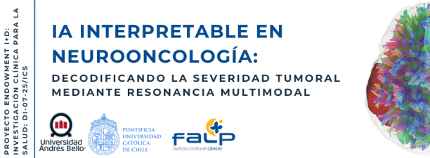

# Workshop: IA Interpretable en Neurooncología: Decodificando la severidad tumoral mediante resonancia multimodal

---

<p align="center">
  <a href="https://docs.google.com/forms/d/e/1FAIpQLScVTNZGnZ7jFYkFfVNsTKiw_LQcgZfaXG4y_08lIPOTNVzjhA/viewform?usp=sharing">
    
  </a>
  <a href="https://github.com/pamelaFranco/workshop_glioma/raw/main/Programa/Charlas___Workshop_IA_Interpretable_Neurooncologia.pdf">
    
  </a>
  <a href="https://www.instagram.com/neuro_artint/">
    
  </a>
</p>

<p align="center">
  <a href="https://docs.google.com/forms/d/e/1FAIpQLScrvB4-sUyraLQAthbE9K0Ph2O1xWT8xWlNHzRo8drDvrYp3Q/viewform?usp=sharing">
    
  </a>
  <a href="mailto:neurooncologia.ia@gmail.com">
    
  </a>
</p>

---

## Introducción
Este repositorio contiene los materiales para el laboratorio virtual sobre neurooncología de precisión. El workshop integra seis fases críticas del análisis de imágenes médicas:

1. **Fundamentos del Espacio K:** Exploración del dominio de la frecuencia en RM.
2. **Física de Resonancia:** Generación de mapas paramétricos ($T1$ y $T2$).
3. **Microestructura Tisular:** Procesamiento de Tensores de Difusión ($DTI$).
4. **Mapeo Funcional:** Exploración de la dinámica de la señal $BOLD$ y $fMRI$.
5. **Hemodinámica y Biomecánica:** Reconstrucción de vasculatura mediante $TOF-MRA$.
6. **IA Interpretable:** Decodificación de severidad mediante radiómica y $SHAP$.

---

## Cómo usar este Workshop

La forma más sencilla de ejecutar el laboratorio es a través de **Google Colab**, ya que no requiere instalación local.

1.  **Selecciona el módulo:** Haz clic en el botón **"Open In Colab"** de la actividad deseada.
2.  **Configuración de Datos:** Los notebooks cargan automáticamente los archivos desde este repositorio. Ejecuta las celdas en orden.
3.  **Interactividad:** En el módulo del Espacio K, utiliza el slider para mover el control del radio en un filtro de paso bajo circular, de esa forma verás cuánta información permitimos que regrese del dominio de la frecuencia al dominio de la imagen. Además, en el módulo de la IA, utiliza el slider del "Simulador Clínico" para explorar las explicaciones de SHAP.

---

## Actividades del Workshop

### Actividad 1: Fundamentos del Espacio K y Formación de Imágenes
* **Objetivo:** Comprender la relación entre el Espacio K y la imagen real mediante la Transformada de Fourier.
* **Cuaderno:** [](https://colab.research.google.com/github/pamelaFranco/workshop_glioma/blob/main/Code/EspacioK.ipynb)

### Actividad 2: Generación de Mapas Paramétricos ($T1$ y $T2$)
* **Objetivo:** Calcular mapas de tiempos de relajación utilizando modelos de ajuste no lineal.
* **Cuaderno:** [](https://colab.research.google.com/github/pamelaFranco/workshop_glioma/blob/main/Code/T1_T2_maps.ipynb)

### Actividad 3: Mapas de Difusión ($DTI$)
* **Objetivo:** Mapear la arquitectura funcional del cerebro mediante el análisis de correlaciones de señales de baja frecuencia en estado de reposo ($rs-fMRI$).
* **Cuaderno:** [](https://colab.research.google.com/github/pamelaFranco/workshop_glioma/blob/main/Code/DTI_mapas_difusion.ipynb)

### Actividad 4: Mapeo Funcional ($fMRI$)
* **Objetivo:** Obtener mapas de Fracción de Anisotropía ($FA$), Difusividad Media ($MD$), Difusividad Radial ($RD$) y Difusividad Axial ($AD$) para caracterizar la infiltración tumoral.
* **Cuaderno:** [](https://colab.research.google.com/github/pamelaFranco/workshop_glioma/blob/main/Code/fMRI.ipynb)

### Actividad 5: Hemodinámica y Biomecánica Cerebral ($TOF-MRA$)
* **Objetivo:** Reconstrucción de la vasculatura mediante el uso de imágenes adquiridas en la secuencia Time-Of-Flight ($TOF-MRA$) y la aplicación de la Proyección de Máxima Intensidad ($MIP$).
* **Cuaderno:** [](https://colab.research.google.com/github/pamelaFranco/workshop_glioma/blob/main/Code/Vasculatura_Cerebral.ipynb)

### Actividad 6: Predicción de Severidad con IA (Radiómica)
* **Objetivo:** Modelar la severidad del tumor mediante Machine Learning interpretable (Caja Blanca).
* **Cuaderno:** [](https://colab.research.google.com/github/pamelaFranco/workshop_glioma/blob/main/Code/Glioma_classification.ipynb)

---

## Envío de Resúmenes ($Abstracts$)

Invitamos a investigadores y especialistas a presentar trabajos relacionados con procesamiento de imágenes médicas, Machine Learning/Deep Learning y aplicaciones en salud.

> **Fecha límite:** 15 de noviembre de 2026, 23:59 PM (UTC-3).

### ¿Cómo obtener la plantilla?
* **Opción A: Formato Word** - [Descargar desde Google Drive](https://docs.google.com/document/d/1190HBUgn2zWm8GyvswGrgzw2nrgt1yDC/edit?usp=drive_link&ouid=100388382858978154255&rtpof=true&sd=true)
* **Opción B: Formato LaTeX** - [Acceder a los archivos en GitHub](https://github.com/pamelaFranco/workshop_glioma/blob/main/Formato%20Abstract/Formato_Resumen___Workshop_IA_Interpretable_Neurooncologia.zip)

---

## Estructura del Repositorio

* **`Code/`**: Notebooks `.ipynb` de todas las actividades.
* **`Dataset/`**: Archivos `.mat`, `.nii.gz`, `.dcm` y `.csv` necesarios para los análisis.
* **`Figuras/`**: Recursos visuales y diagramas explicativos.
* **`Formato Abstract/`**: Planillas para escribir el resumen ($abstract$) en formato Word y LaTeX.
* **`Template/`**: Formato editable de la charla (PPTX).
* **`Programa/`**: Cronograma del workshop con los expositores y sus horarios.
---

## Requisitos Técnicos (Uso Local)
Si prefieres ejecución local, requiere:
* Python 3.10+
* Librerías: `pandas`, `numpy`, `scikit-learn`, `nibabel`, `dipy`, `nilearn`, `shap`, `matplotlib`, `scipy`.


---

## Respaldo Científico y Cita

Este laboratorio virtual implementa los findazgos descritos en el estudio:

<p align="center">
  <a href="https://link.springer.com/article/10.1007/s10334-025-01278-8">
    
  </a>
  <a href="https://ieeexplore.ieee.org/document/11302837">
    
  </a>
</p>

Si utilizas este código o dataset para tu investigación, por favor cita los siguientes trabajos:

```bibtex
@article{Franco2026Glioma,
  title={Beyond Binary Classification: A Pilot Study of Imaging-Derived Glioma Severity Modeling Using T1-Weighted and Diffusion MRI Radiomics},
  author={Franco, Pamela and Montalba, Cristian and Caulier-Cisterna, Raúl and Espinoza, Ignacio and Cornejo, M. Daniela and others},
  journal={Magnetic Resonance Materials in Physics, Biology and Medicine (MAGMA)},
  year={2026},
  note={10.1007/s10334-026-01346-7}
}

@inproceedings{Franco2025ICPRS,
  title={Radiomic Glioma Grading Using T1-weighted MRI vs. Diffusion Tensor Metrics: A Proof-of-Concept Comparative Analysis with Explainable Machine Learning},
  author={Franco, Pamela and Montalba, Cristian and Caulier-Cisterna, Raúl and Espinoza, Ignacio and Cornejo, and others},
  booktitle={2025 15th IEEE International Conference on Pattern Recognition Systems (ICPRS)},
  pages={1--7},
  year={2025},
  publisher={IEEE},
  doi={10.1109/ICPRS64124.2025.11302837}
}

@article{Franco2025ESMRMB,
  title={Explainable machine learning models for radiomic-based assessment of glioma severity using multiparametric MRI (Abstract \#215)},
  author={Franco, Pamela and Montalba, Cristian and Caulier-Cisterna, Raúl and Espinoza, Ignacio and Bennet, Carlos and Torres, Francisco and Chabert, Steren and Salas, Rodrigo},
  journal={Magnetic Resonance Materials in Physics, Biology and Medicine},
  volume={38},
  number={1},
  pages={201--202},
  year={2025},
  publisher={Springer},
  doi={10.1007/s10334-025-01278-8},
}

```

---

##  Agradecimientos
Este trabajo fue financiado por el Concurso Endowment I + D en Salud de la Universidad Andrés Bello (UNAB) 2025, proyecto DI-07-25/ICS


--- 

## License

[](https://opensource.org/licenses/MIT)
[](https://www.python.org/downloads/)

